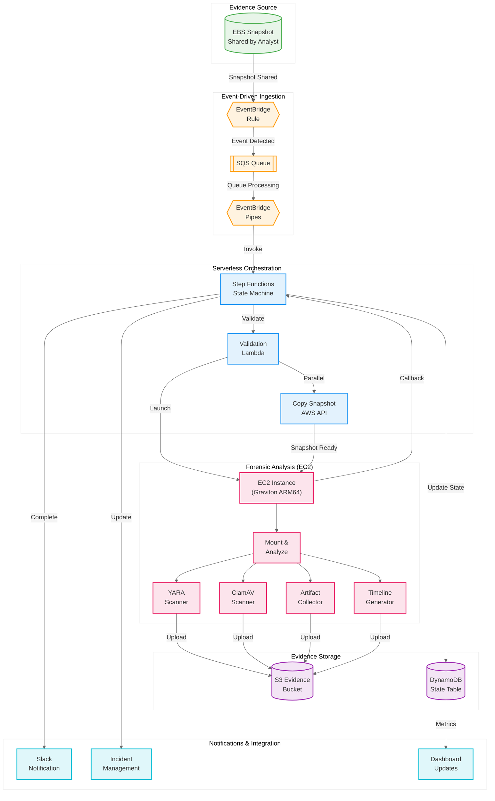
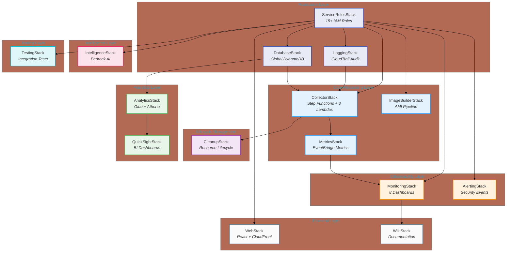
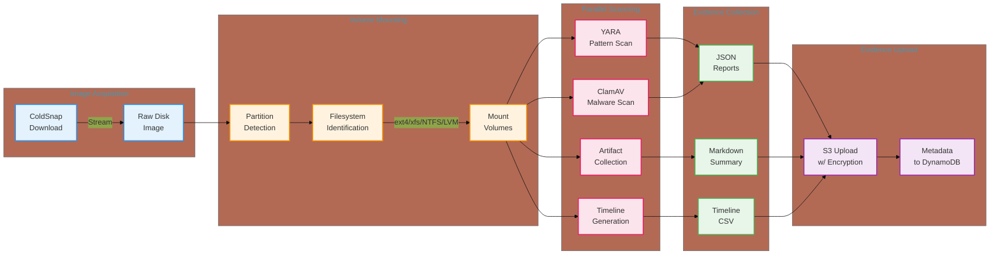
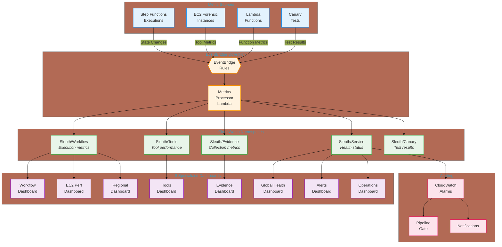

When a security incident strikes, time is the enemy. Every minute spent on manual forensic analysis is a minute an attacker could be deepening their foothold. For security teams handling cloud workloads, the challenge is amplified: how do you analyze potentially terabytes of disk data quickly, consistently, and without specialized forensic expertise?

This is the story of **Snapshot-Sleuth**, a serverless forensic automation system that transforms EBS snapshot analysis from a manual, hours-long process into an automated workflow completing in minutes. Built on AWS serverless primitives and orchestrated through event-driven patterns, the system achieved a **71% reduction in processing time** while handling over 100 forensic analyses across 50+ security incidents.

The architecture spans 16 CDK stacks, 30+ Lambda functions, and ~25,000 lines of code across TypeScript, Python, and React. More importantly, it demonstrates how thoughtful architectural decisions compound into measurable operational impact.

## The Challenge: Manual Forensics at Cloud Scale

Before automation, forensic analysis of EBS snapshots followed a familiar pattern: an analyst would receive a snapshot, manually copy it to a forensic workstation, mount the volumes, run various scanning tools, collect artifacts, and compile findings. A typical 100GB snapshot took 2-3 hours of analyst time. Larger volumes—common in enterprise workloads—could consume an entire day.

The process suffered from several compounding problems:

**Serial execution bottlenecks.** Each step waited on the previous one. Copying a snapshot blocked scanning. Scanning blocked analysis. Nothing ran in parallel.

**Expertise concentration.** Only a handful of team members understood the full forensic toolkit. When they were unavailable, incidents queued.

**Inconsistent coverage.** Manual processes meant variable depth of analysis. Some analysts ran comprehensive scans; others took shortcuts under time pressure.

**Scale limitations.** The legacy system struggled with snapshots over 5TB. Large enterprise volumes required workarounds or went unanalyzed.

**Regional constraints.** Data sovereignty requirements meant evidence couldn't cross certain boundaries. Analysts needed to work within specific regions, complicating tooling setup.

The core insight was that most forensic triage follows predictable patterns. The same tools run in the same order, producing similar artifact types. What varied was only the input data. This made the problem amenable to automation—not replacing analyst judgment, but eliminating repetitive manual steps.

## Architecture Evolution: From Monolithic to Event-Driven

The redesign centered on three principles: event-driven processing, serverless-first with hybrid compute, and Infrastructure as Code for consistency.

### Event-Driven Ingestion

The workflow begins when an analyst shares an EBS snapshot with the forensic system's AWS account. This simple action—standard AWS snapshot sharing—triggers everything that follows.



EventBridge detects the snapshot sharing event and routes it to an SQS queue. EventBridge Pipes (in supported regions) or a fallback Lambda invokes the Step Functions state machine. This decoupled ingestion provides natural backpressure handling and ensures no events are lost during system updates.

### Serverless Orchestration with Hybrid Compute

Step Functions orchestrates the workflow, but the actual forensic analysis runs on EC2. This hybrid approach reflects a key architectural decision: use Lambda for coordination (fast, scalable, cost-efficient) but EC2 for compute-intensive forensics (predictable performance, larger storage, longer runtime).

The connection uses Step Functions' **Task Token callback pattern**. When the state machine needs to run forensic analysis, it launches an EC2 instance with a task token embedded in the userdata. The EC2 instance performs analysis—which can run for hours on large snapshots—and calls back to Step Functions when complete:

```python
# EC2 instance callback after forensic analysis
sfn_client.send_task_success(
    taskToken=task_token,
    output=json.dumps({
        "status": "completed",
        "evidence_location": f"s3://{bucket}/{case_id}/",
        "findings_summary": summary
    })
)
```

This pattern gives us the best of both worlds: Step Functions handles state management, retries, and timeouts, while EC2 provides the compute resources forensic tools need.

### 16-Stack Architecture

The infrastructure is organized into 16 specialized CDK stacks, each with clear responsibilities:



This separation provides several benefits. Stacks deploy independently, reducing blast radius during updates. IAM roles are centralized in ServiceRolesStack, preventing permission sprawl. The observability layer can evolve without touching core processing.

## Technical Implementation Deep Dive

### Management Plane: Lambda Orchestration

The TypeScript Lambda functions handle workflow coordination. Each function uses AWS Lambda Powertools for consistent logging, metrics, and tracing:

```typescript
import { Logger } from '@aws-lambda-powertools/logger';
import { Metrics, MetricUnits } from '@aws-lambda-powertools/metrics';
import { Tracer } from '@aws-lambda-powertools/tracer';

const logger = new Logger({ serviceName: 'snapshot-sleuth-validator' });
const metrics = new Metrics({ namespace: 'Sleuth/Workflow' });
const tracer = new Tracer({ serviceName: 'snapshot-sleuth-validator' });

export const handler = async (event: SnapshotEvent) => {
  logger.info('Processing snapshot', { snapshotId: event.snapshotId });

  const subsegment = tracer.getSegment()?.addNewSubsegment('ValidateSnapshot');

  try {
    const isValid = await validateSnapshotAccess(event.snapshotId);
    metrics.addMetric('ValidationSucceeded', MetricUnits.Count, 1);
    subsegment?.addAnnotation('validated', true);
    return { ...event, validated: true };
  } finally {
    subsegment?.close();
  }
};
```

The key Lambda functions include:

- **Validator**: Confirms snapshot accessibility and extracts metadata
- **InstanceLauncher**: Provisions EC2 with appropriate configuration based on snapshot size
- **IncidentUpdater**: Synchronizes status with incident management systems
- **NotificationSender**: Delivers completion alerts via Slack webhooks

### Data Plane: Python Forensic Orchestrator

The EC2-based forensic analysis runs a Python orchestrator that coordinates four specialized tools:



Each scanner implements a common interface with timeout protection—critical when scanning unknown filesystems:

```python
class ForensicScanner(ABC):
    def __init__(self, timeout_seconds: int = 3600):
        self.timeout_seconds = timeout_seconds

    def execute_with_timeout(self, target_path: str) -> ScanResult:
        signal.signal(signal.SIGALRM, timeout_handler)
        signal.alarm(self.timeout_seconds)

        try:
            return self.scan(target_path)
        except TimeoutError:
            return ScanResult(
                tool_name=self.__class__.__name__,
                success=False,
                error_message="Execution timed out"
            )
        finally:
            signal.alarm(0)
```

The factory pattern makes it straightforward to add new scanners without modifying orchestration code:

```python
class ScannerFactory:
    _scanners = {
        "yara": YaraScanner,
        "clamav": ClamAVScanner,
        "artifacts": ArtifactCollector,
        "timeline": TimelineGenerator,
    }

    @classmethod
    def create(cls, scanner_type: str, **kwargs) -> ForensicScanner:
        return cls._scanners[scanner_type](**kwargs)
```

### Frontend: React Dashboard

The React frontend provides real-time visibility into forensic workflows. Built with Cloudscape Design System and React Query, it offers automatic refresh and efficient caching:

```typescript
export const useEngagements = (filters?: EngagementFilters) => {
  return useQuery<Engagement[]>(
    ['engagements', filters],
    async () => {
      const response = await fetch('/api/engagements', {
        credentials: 'include',  // SSO authentication
      });
      return response.json();
    },
    {
      refetchInterval: 30000,  // Refresh every 30 seconds
      staleTime: 10000,
    }
  );
};
```

## Forensic Tools Integration

### YARA Pattern Detection

YARA scans the entire mounted filesystem looking for patterns defined in rule files. These rules can detect malware signatures, suspicious file contents, or known indicators of compromise. The scanner emits detailed metrics:

```python
@xray_recorder.capture("yara_scan")
def scan(self, target_path: str) -> ScanResult:
    rules = yara.compile(filepath=self.rules_path)

    for root, dirs, files in os.walk(target_path):
        for filename in files:
            matches = rules.match(filepath, timeout=60)
            if matches:
                detections.append({
                    "file": filepath,
                    "rules": [m.rule for m in matches],
                    "tags": [tag for m in matches for tag in m.tags]
                })

    metrics.add_metric("DetectionCount", "Count", len(detections))
    return ScanResult(tool_name="YARA", detections=detections)
```

### Multi-Filesystem Support

Cloud workloads run on various operating systems and configurations. The partition analyzer handles:

- **Linux filesystems**: ext2, ext3, ext4, xfs, btrfs
- **Windows filesystems**: NTFS
- **Logical volumes**: LVM detection and activation
- **Encrypted volumes**: LUKS container identification

Each filesystem type has a specialized handler implementing a common mounting interface. The system automatically detects partition types and applies appropriate mounting options.

## Performance & Scale

The automation delivered measurable improvements across all snapshot sizes:

| Snapshot Size | Legacy Manual | Automated System | Improvement |
|---------------|---------------|------------------|-------------|
| 8 GB | ~35 minutes | ~10 minutes | 71% |
| 100 GB | ~2.5 hours | ~45 minutes | 70% |
| 1 TB | ~10 hours | ~2.5 hours | 75% |
| 5 TB | ~24+ hours | ~8 hours | 67% |

**Average improvement: 71%**

Beyond raw speed, the system delivers:

- **150+ hours** of cumulative analyst time recovered
- **90% adoption** rate among the security team
- **65% of cases** where automation identified root cause
- **100+ snapshots** processed across 50+ incidents

Several architectural decisions enable this performance:

**Parallel tool execution.** All four scanners run simultaneously rather than sequentially. A 1TB snapshot that previously took 10 hours of serial scanning now completes in 2.5 hours of parallel work.

**Right-sized compute.** The instance launcher analyzes snapshot size and provisions appropriate EC2 instances. Small snapshots get m7g.xlarge; larger volumes get m7g.4xlarge with additional EBS throughput.

**Graviton instances.** ARM64 Graviton processors provide better price-performance than x86 equivalents, reducing per-analysis costs by approximately 40%.

**Regional processing.** Evidence stays within its originating region, eliminating cross-region data transfer delays and maintaining compliance with data sovereignty requirements.

## Operational Excellence

### Observability Architecture

The system evolved through three observability phases:

**Phase 1: Basic logging.** CloudWatch Logs for all Lambda functions and EC2 instances. Structured logging with consistent fields (case ID, snapshot ID, region) enables correlation.

**Phase 2: Distributed tracing.** X-Ray integration across Lambda and EC2 provides end-to-end visibility. Custom decorators enable graceful degradation when X-Ray isn't available:

```python
def trace(name: Optional[str] = None, namespace: str = "Sleuth"):
    def decorator(func: Callable):
        @wraps(func)
        def wrapper(*args, **kwargs):
            if not XRAY_ENABLED:
                return func(*args, **kwargs)

            with xray_recorder.in_subsegment(name or func.__name__) as subsegment:
                subsegment.put_annotation("namespace", namespace)
                try:
                    return func(*args, **kwargs)
                except Exception as e:
                    subsegment.add_exception(e, stack=True)
                    raise
        return wrapper
    return decorator
```

**Phase 3: Modular dashboards.** Eight specialized CloudWatch dashboards, each a reusable CDK construct:



The metrics processor captures Step Functions state changes via EventBridge and emits CloudWatch metrics, enabling near-real-time dashboard updates without polling.

### Testing Strategy

Testing follows a hierarchical approach, balancing speed with thoroughness:

- **Integration tests** (< 5 min): Validate resource existence and IAM permissions. Run on every deployment.
- **Component tests** (< 10 min): Verify EventBridge triggers, SQS message flow, Step Functions invocation.
- **Workflow tests** (< 15 min): End-to-end snapshot processing with synthetic data.
- **Canary tests** (hourly): Continuous validation in production environments.

All test resources are tagged with a standard identifier (`TEST-0404`), enabling automated daily cleanup that removes orphaned resources without affecting real incidents.

### Security Hardening

Forensic systems handle sensitive data by definition. Security measures include:

- **VPC isolation**: Forensic EC2 instances run in private subnets with no internet gateway. All AWS API access goes through VPC endpoints.
- **Encryption everywhere**: S3 buckets use KMS encryption. DynamoDB, SQS, and SNS all enable encryption at rest. EFS volumes are encrypted.
- **Least privilege IAM**: 15+ specialized roles with minimal permissions. Cross-account access uses explicit role assumptions.
- **Audit logging**: Multi-region CloudTrail with 10-year retention captures all API activity.

## Lessons Learned

### What Worked Well

**Event-driven architecture simplifies scaling.** The EventBridge → SQS → Step Functions chain handles traffic spikes gracefully. During an incident involving multiple compromised systems, the queue absorbed bursts while processing continued at sustainable rates.

**Modular dashboards beat monolithic monitoring.** The original monitoring code exceeded 1,000 lines in a single file. Refactoring into eight specialized constructs (~200-500 lines each) made maintenance tractable and enabled dashboard reuse across environments.

**Task token callbacks are powerful.** The Step Functions callback pattern elegantly bridges serverless orchestration with long-running EC2 workloads. State persists in Step Functions while compute runs wherever it needs to.

**CDK constructs compound value.** Reusable constructs for queues, topics, and Lambda configurations ensured consistency across 16 stacks. When security requirements changed, updates propagated automatically.

### Challenges Overcome

**Regional variations require abstraction.** Not all AWS regions support all services equally. EventBridge Pipes isn't available everywhere. Some regions lack specific VPC endpoints. Configuration files map region capabilities, and deployment logic adapts accordingly.

**Large snapshot handling needed iteration.** Initial designs struggled with snapshots over 2TB. The solution: EFS for working storage, streaming downloads via ColdSnap, and parallel partition mounting.

**Dashboard performance requires selectivity.** Early dashboards pulled too many metrics, causing slow load times. Focusing each dashboard on a specific domain (workflow, tools, evidence) improved both performance and usability.

### Future Directions

The architecture supports several planned enhancements:

- **Additional forensic tools**: Memory analysis capabilities, registry deep-dive for Windows volumes
- **ML-based anomaly detection**: Pattern recognition for unusual file distributions or access patterns
- **Automated remediation workflows**: Integration with response orchestration for common scenarios
- **Cross-cloud support**: Extending snapshot analysis to Azure and GCP disk images

## Conclusion

Snapshot-Sleuth demonstrates that thoughtful architecture choices compound into meaningful operational improvements. The 71% reduction in processing time isn't magic—it's the aggregate effect of parallel execution, right-sized compute, event-driven coordination, and consistent automation.

For teams considering similar systems, the key takeaways are:

1. **Automate the predictable.** If analysts run the same tools in the same order, that's a candidate for automation.
2. **Use hybrid compute strategically.** Lambda for orchestration, EC2 for heavy lifting. Don't force serverless where it doesn't fit.
3. **Invest in observability early.** The dashboard evolution from basic logs to distributed tracing to specialized monitoring paid dividends in debugging and optimization.
4. **Design for regional variation.** Cloud infrastructure varies by region. Abstract these differences rather than fighting them.
5. **Make Infrastructure as Code non-negotiable.** 16 stacks deploying consistently across 20+ regions would be impossible without CDK.

The best forensic analysis still requires human judgment. What automation provides is the time for analysts to exercise that judgment—minutes instead of hours, insight instead of data extraction. That's the difference between responding to incidents and actually resolving them.

---

*This case study describes architectural patterns and approaches from a production forensic automation system. Specific tool names, metrics, and implementation details have been generalized for public presentation.*
